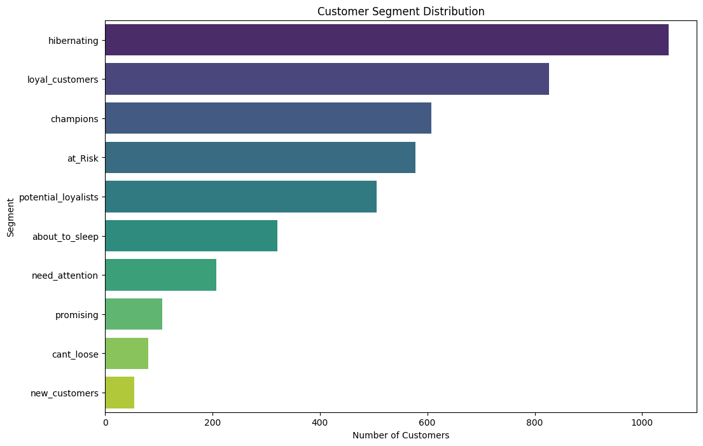

# 🛒 Retail Customer Segmentation (RFM Analysis)

## 📊 Project Overview
This project analyzes over **500,000 rows** of transaction data from an Online Retail store. The goal is to identify high-value customers and those at risk of leaving (churning).

## 💡 Key Business Insights
- **Total Customers Analyzed:** 4,372
- **VIP Champions:** 607 customers contributing the highest revenue.
- **Revenue at Risk:** **$569,172** identified across 578 "At Risk" customers.
- **Action Plan:** Generated a targeted list for the Marketing Team to prevent churn.

## 🛠️ Tools Used
- **Language:** Python
- **Libraries:** Pandas (Data Cleaning), Matplotlib/Seaborn (Visualization)
- **Environment:** Google Colab

